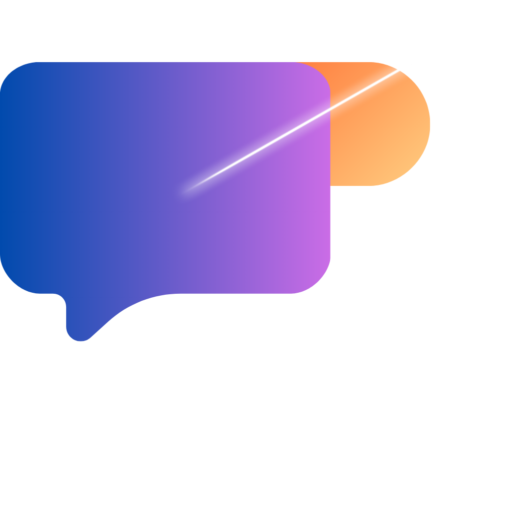
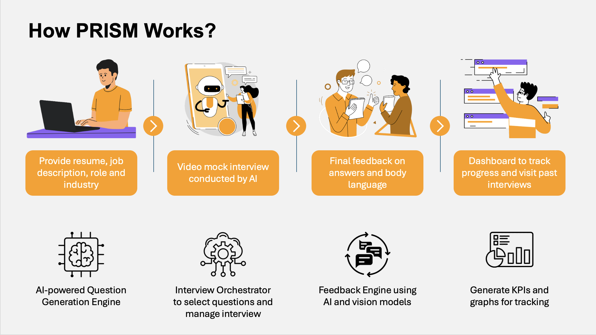
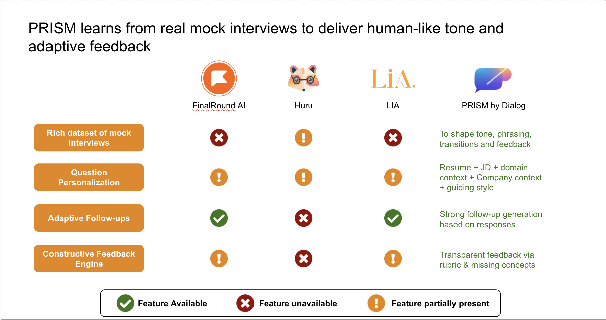

<h1 align="center">PRISM: Personal Response and Interview Simulation Model</h1>

<h3 align="center"> A product by Dialog</h3>

<p align="center">
  
</p>

## Project Motivation

> *“I read all the guides, practiced questions from LeetCode, and even watched mock interview videos, but the actual interview turned out to be very different.”*  

> *“I had practiced multiple technical questions. Yet, when the real interview started, I froze.”*  

> *“If only I could practice with an AI that actually understood my resume, asked realistic questions, and helped me improve.”*  


Jane is a student of Applied Data Science at the University of Chicago. She’s been on the job hunt for a couple of months now, applying to roles like *Data Scientist*, *Machine Learning Engineer*, and *Data Analyst* at her dream companies.

Jane is talented and hardworking, she’s comfortable with Python, knows how to tune a model, and can explain cross-validation without notes.  

But when it comes to **interviews**, she feels stuck.

She spends hours searching online for *“data science interview questions”*. Most results are generic or outdated, and she’s never sure which ones match the latest industry expectations. She occasionally practices with friends, but those mock interviews often turn into casual chats with little useful feedback. And while professional interview coaches promise tailored guidance, each session can cost **$100–$300**. Not something she can afford often as a student.

To fill the gap, Jane also turns to **AI tools like ChatGPT and Gemini** for help. They generate useful questions and explanations, but the experience feels **one-size-fits-all**. The AI doesn’t know her resume, her experience with time series forecasting, or the specific job she’s applying for. There’s no **context**, no **follow-up questioning**, and no **personalized feedback** on how she’s performing.

That’s the gap this **AI-powered mock interview platform** aims to fill. Helping users like Jane **practice smarter, not just harder**, through **context-aware, interactive, and adaptive AI interviews**.

---

### 🎯 The Problem

Preparing for technical interviews is often **overwhelming and inefficient**.  

- It takes around **30 hours to cover the basics** and up to **100 hours** to be well-prepared for technical interviews. [Tech Interview Handbook](https://www.techinterviewhandbook.org/coding-interview-prep/?utm_source=chatgpt.com)
- Even for non-technical interviews, candidates spend about **5–10 hours** on preparation. [Indeed](https://www.indeed.com/career-advice/interviewing/how-long-should-you-prepare-for-an-interview?utm_source=chatgpt.com)
- For DS/ML or coding roles, many candidates dedicate over **15 hours per week** leading up to interviews. [Helen Zhang, Medium](https://helen-zhang.medium.com/the-4-week-plan-to-nailing-your-next-coding-technical-interview-internship-level-c5368c47e1d?utm_source=chatgpt.com)
- Technical interviews themselves can last **30–60 minutes or more**, requiring on-the-spot reasoning and composure. [Coursera](https://www.coursera.org/articles/how-long-do-interviews-last?utm_source=chatgpt.com)
- Despite this effort, **65% of job seekers** say they struggle to find **trustworthy, realistic practice resources**. [Aptitude Research Report](https://www.aptituderesearch.com/wp-content/uploads/2022/06/Apt_Interviewing_Report-0622_Final.pdf?utm_source=chatgpt.com)
- Personalized coaching can cost **$100–$300 per session**, making consistent practice inaccessible. [Glassdoor & Coaching Industry Estimates](https://www.prnewswire.com/news-releases/glassdoor-study-reveals-interview-process-getting-longer-averaging-about-24-days-across-25-countries-300501746.html?utm_source=chatgpt.com)

The result?  
Even skilled candidates often **underperform** in interviews because they lack a safe, adaptive way to practice under realistic conditions.

---

### The Vision

We aim to build a platform where anyone can **practice, learn, and grow**.

- Upload your **resume and job description**. Input the role and industry. The AI instantly tailors questions to your experience.  
- The system **retrieves domain-specific technical questions** (via RAG from trusted data science sources).  
- Engage in a **dynamic, multi-turn conversation**, where follow-ups depend on your previous answers.  
- Receive **feedback on content, depth, communication, and confidence**, supported by curated corpus, interviews and use of vision models.  
- Track your **progress across sessions**, identifying improvement areas over time.

---
## Overview



## Project

PRISM integrates multiple AI components, namely <b>retrieval, orchestration, and evaluation</b> to replicate the depth and realism of an actual interview. Each module contributes to creating a personalized, adaptive, and feedback-driven experience.

It combines **RAG-based retrieval**, **context-aware orchestration**, and **multi-layer evaluation** by integrating traditional NLP pipelines with large language models (LLMs), multimodal (vision + text) analytics, and reinforcement loops from real interview data.

---

### 1. Resume Parsing & Candidate Profiling

Builds a **semantic profile** of the candidate, enabling downstream modules to personalize questions and feedback.

 - Dedicated user profile section to upload multiple resumes
 - Uses OpenAI GPT-4o to extract name, professional summary, core skills and project domains, experience, industry exposure (e.g., healthcare, retail, fintech)
 - The parsed data is structured as a JSON profile that feeds directly into the Question Selection Engine (QSE).
 - This ensures every question aligns with the candidate’s unique background.

**Pipeline:**
1. **Input Handling:**  
   - Accepts `.pdf` or `.docx` resumes uploaded by the candidate.  
   - Extracts text using `PyMuPDF` (PDF) or `python-docx` (Word).  
2. **Parsing Layer:**  
   - Sends text to the **OpenAI GPT-4o API** with a structured JSON extraction prompt.  
   - Returns fields including:
     - `name`, `summary`
     - `skills[]`, `academic_projects[]`, `work_experience[]`
     - `total_experience (float)`
     - `core_skills[]`, `project_domains[]`, `work_context[]`
3. **Output Structuring:**  
   - Cleans and standardizes extracted entities.  
   - Stores profile in JSON and optionally persists to Firestore/Postgres.  
4. **Embedding Generation:**  
   - Computes **OpenAI `text-embedding-ada-002`** vectors for each skill, project, and domain-feeding into the question retrieval system.

**Key Code Components:**  
- `resume_parser.py`  
---

### 2. Data Science Knowledge Corpus

A strong question foundation requires a high-quality knowledge base.

 - PRISM maintains a custom corpus of curated data science content:
 - Technical articles from GeeksforGeeks, Towards Data Science, and other reliable sources.
 - A Q-A dataset compiled from curated interview transcripts and technical discussions.
 - 20+ real mock interviews (conducted internally) containing question-answer-feedback triples.
 - Corpus stored and indexed in Pinecone Vector DB with OpenAI embeddings (text-embedding-ada-002), enabling semantic retrieval via RAG (Retrieval-Augmented Generation).

To provide grounded, domain-relevant interview questions and context, PRISM builds and maintains a **vectorized knowledge base**.

**Composition:**
- **Web-scraped articles** from GeeksforGeeks, Towards Data Science, Analytics Vidhya.  
- **Manually curated markdowns** of core DS/ML topics (e.g., XGBoost, optimization, DBSCAN).  
- **20+ human-conducted mock interviews**, annotated with Q–A–Feedback–Score tuples.  

**Storage & Retrieval Architecture:**
- All documents chunked (≈300 tokens per chunk).  
- Embedded via `text-embedding-ada-002` → stored in **Pinecone** (dim=1536).  
- Indexed with metadata:  
  - `{topic, subtopic, source, difficulty, type ("technical"/"behavioral")}`  
- Retrieval handled using **LangChain’s vector retriever**, ranked by cosine similarity.

**Purpose:**  
Provides RAG-based retrieval of both *factual* and *situational* questions, ensuring every interview remains grounded in verified knowledge.

---

### 🤖 3. Question Selection Engine (QSE)

The QSE dynamically generates, retrieves, and ranks interview questions based on **resume context**, **domain corpus**, and **live industry data**.

How it works:
 - Reads the candidate’s resume JSON and extracts relevant skills, projects, and domains.
 - Performs a live web scroll using the Perplexity API, fetching the most recent questions asked for the chosen company, role, or industry (e.g., Google, Healthcare, Retail).
 - Retrieves semantically similar questions from the RAG corpus using Pinecone.
 - Generates a mix of <b>Resume-based questions, Technical concept questions, Live questions using Perplexity’s recent web data</b>
 - Dynamically generates follow-up questions, conditioned on the candidate’s previous answers.

Output:
A structured interview plan with 12–15 primary questions, each optionally followed by up to 3 dynamic follow-ups.

**Architecture:**


**Steps:**
1. **Topic Extraction:**  
   - Extracts candidate topics (skills, domains, keywords) using regex + LLM expansion (via GPT-4o).  
   - Optionally expands topic list with synonyms using a helper like `expand_topics_with_gpt()`.  
2. **RAG Retrieval:**  
   - Queries Pinecone for top-k chunks (k≈5–10 per topic).  
   - Extracts Q–A pairs or snippets containing question patterns (`"?"` heuristics).  
3. **Live Web Scroll:**  
   - Uses **Perplexity API (`sonar-medium-chat`)** to retrieve recent interview questions for given company/role/industry.  
   - Returns `(question, source_url, date)` tuples sorted by recency.  
4. **Question Ranking:**  
   - Combines results from RAG + web scroll.  
   - Re-ranks based on:
     - Skill relevance (cosine similarity)  
     - Recency (weighted decay)  
     - Coverage (ensures variety across skills)  
5. **Follow-up Generation:**  
   - Uses AI to create 1–3 follow-up questions per main question, conditioned on candidate answers.

**Tech stack:**  
`OpenAI GPT-4o`, `Perplexity API`, `LangChain`, `Pinecone`, `scikit-learn`, `Python`

---

### 4. Interview Orchestrator

The **Orchestrator** is PRISM’s control layer — managing interview flow, state, and conversational context.

The Interview Orchestrator manages the flow between modules, ensuring that the conversation remains adaptive and context-aware.

 - Monitors the candidate’s answers and dynamically adjusts difficulty and topic coverage.
 - Keeps track of conversation state, context tokens, and progress.
 - Decides whether to:
  - Ask a follow-up question
  - Switch topics
  - Move to behavioral or wrap-up questions
- Sends candidate responses to the Feedback Engine asynchronously for live evaluation.

This is the “brain” that connects all components, maintaining continuity and realism throughout the session.

**Responsibilities:**
- Maintains **state memory**: previous questions, candidate responses, score history.  
- Routes logic between QSE, feedback engine, and UI.  
- Decides the next action:
  - `ask_followup`  
  - `switch_topic`  
  - `move_to_behavioral`  
  - `end_interview`
- Manages conversation persistence using a JSON state or Redis cache for real-time web interviews.  
- Normalizes temperature and token usage dynamically based on model response confidence.

**Logic Example:**
```python
if score < 6 and followup_count < 3:
    next_question = generate_followup(answer, context)
else:
    next_question = qse.get_next_topic_question()
```

### 5. Feedback Engine

The **Feedback Engine** converts answers into structured evaluations, providing both **numeric** and **natural-language** insights.

#### 🔹 Architecture


#### 🔸 Components

1. **Rubric Files**
   - YAML/JSON definitions for both *technical* and *behavioral* rubrics.  
   - Each rubric defines:
     ```json
     {
       "criteria": ["Technical Accuracy", "Relevance", "Depth", "Communication", "Confidence"],
       "weights": [0.35, 0.25, 0.2, 0.15, 0.05]
     }
     ```
   - Behavioral rubrics add “Empathy”, “Situation-Task-Action-Result (STAR)” as criteria.  

2. **Concept Weightages**
   - Stored in lookup tables (`concept_weights.json`).  
   - Example:
     ```json
     {"Logistic Regression": {"Cost Function": 0.5, "Regularization": 0.3, "AUC": 0.2}}
     ```

3. **Two-Stage Evaluation**
   - **Stage 1: Numeric Scoring**  
     - GPT-4o evaluates answers against rubrics → returns JSON of sub-scores and missing keywords.  
     - Example output:
       ```json
       {"Technical Accuracy": 7, "Depth": 6, "Missing": ["regularization term", "cross entropy"]}
       ```
   - **Stage 2: English Feedback**  
     - GPT-4o converts numeric results into empathetic, constructive language.  
     - Adds resource links from corpus (`geeksforgeeks.com`, `towardsdatascience.com`, etc.)

4. **Vision Feedback (Experimental)**
   - Integrates **Google MediaPipe** to capture:
     - Eye-blink rate  
     - Gaze direction / face angle  
     - Posture stability  
     - Gesture frequency  
   - Normalizes these features into engagement/confidence metrics.

5. **Output**
   - Per-question report:
     ```
     Q1: Explain logistic regression.
     Score: 7.5/10
     Strengths: Clear explanation of loss and gradient.
     Improvements: Missed mention of regularization.
     Visual Feedback: Slight gaze aversion detected.
     ```
   - Aggregated session dashboard with topic-wise and rubric-wise averages.

**Tech stack:**  
`Google MediaPipe`, `OpenCV`, `NumPy`, `Pandas`, `Matplotlib`

---

### 🎥 6. Real Mock Interviews Integration

PRISM is trained and validated on **20+ internally conducted mock interviews**, each containing Q–A–Feedback–Score triples.

**Uses:**
- **Fine-tuning interview realism:** Orchestrator prompt templates mirror real interviewer tone.  
- **Feedback calibration:** Align GPT scoring distributions to human-graded baselines.  
- **Vision validation:** Labeled videos used to benchmark blink rate, eye gaze, and posture scoring accuracy.  
- **Continuous improvement:** Candidate self-feedback used to retrain evaluation prompts for empathy and constructiveness.

**Outcomes:**
- A more realistic and human-like interviewing style.  
- Consistent scoring across candidates and sessions.  
- Enhanced robustness of the vision-based feedback module.

**Tech stack:**  
`Python`, `Google MediaPipe`, `LangChain`, `Pandas`

---

## How it compares?




## Setting up the app

```
python3.9 -m venv venv
cd venv
source venv/bin/activate
pip install -r requirements.txt
python manage.py runserver
```
